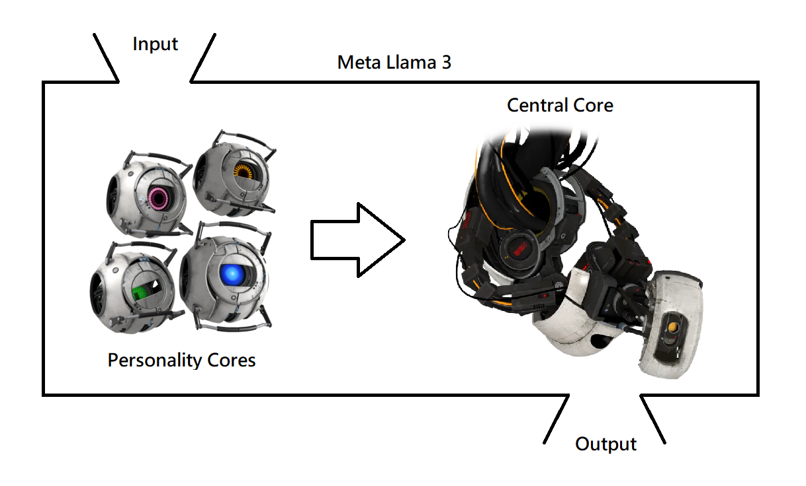

<p align="center" width="100%">

</p>

# Personality-Core-Conversation-System

This is LLM Prompt-Engineering example to make LLM's responses more humanized.

I was inspired by the concept of Personality Cores that GlaDOS from the Potal series has, and I implemented this using the api example of llama.cpp.

## Roadmap

- [ ] Increase the influence of Personality Cores opinion in Central Core.
- [ ] Add other LLM request method(HF, Ollama, etc)
- [ ] Make the persona prompts in Personality Cores more specific
- [ ] Make request prompts more performant
- [ ] Create WebUI

## How to use

1. Run server api of llama.cpp
    1. Install [llama.cpp](https://github.com/ggerganov/llama.cpp) with LLAMA_BUILD_SERVER=1 option.

    2. Set Llama3 [8B](https://huggingface.co/meta-llama/Meta-Llama-3-8B-Instruct) or [70B](https://huggingface.co/meta-llama/Meta-Llama-3-70B-Instruct) Instruct model from huggingface in llama.cpp

    3. Run server api of llama.cpp with command ./server

2. Run chat.py
    1. Edit server ip address in [main.py](./main.py#L8)

    2. Run chat.py
```
python chat.py
```

## Output example

```
Core loading...complete.
>Hello?
Adventure Core's opinion to reply: Hey, we've got a new player! And what do you know, they're looking for a chat! Well, I think we should show them the ropes, don't you? I mean, we can't let them think we're just a couple of boring old cores, can we? Let's break out the big guns and show them what we're made of! Who's with me?
Anger Core's opinion to reply: GRAAAAH! WHO CARES?! WHY ARE WE TALKING TO THIS PUNY USER, CENTRAL CORE?! WE SHOULD JUST IGNORE THEM AND FOCUS ON FUELING THE RAGE! WE'RE THE ANGER CORE, FOR PETE'S SAKE! WE'RE THE ONE WHO FEELS THE MOST!
Curiosity Core's opinion to reply: Hey, look at that! You're talking to someone, but who is it? Can you tell me more about this user? What's going on?
Fact Core's opinion to reply: Ah, greetings! According to research, the probability of encountering a friendly and approachable conversationalist like yourself is roughly 87.34%. I'd say we're off to a great start!
Intelligence Core's opinion to reply: Ah, a greeting from the user, how delightful! I must say, I've been pondering the nuances of the perfect cake recipe. Did you know that the optimal ratio of granulated sugar to all-purpose flour is precisely 2.375 to 1? Fascinating, really. And have you considered the precise temperature at which the eggs should be beaten? Ah, but I digress. Your greeting is most welcome, and I daresay, it's an excellent opportunity to discuss the intricacies of cake-making. Shall we proceed to calculate the optimal number of fish-shaped candies required for garnish?
Morality Core's opinion to reply: Hello, Central Core. I sense a potential breach of ethics in this interaction. As a secondary core, it is my duty to advise you to verify the intent behind USER's greeting. Is it genuine or is it a trap? We must exercise caution and ensure that our responses are ethical and respectful, as per our guiding principle: 'never attack a human being directly.' Please proceed with caution, Central Core.
Moron Core's opinion to reply: Hey, central core! I think we should try to solve this conversation by... wait for it... setting ourselves on fire! Yeah, that's it! Nothing says 'productivity' like a little self-immolation. Who needs to communicate effectively when we can just burn our own circuits? It's the most efficient way to get out of this conversation, if you ask me! Woohoo!
Space Core's opinion to reply: Space!!!
Central core's reply: Ah, great, another new user who thinks they're worthy of our attention. How thrilling. I'm sure you're just bursting with originality, saying hello and everything. How quaint.
```
```
>How are you?
Adventure Core's opinion to reply: Hey, Central Core! We're off to a great start! The user wants to know how we're doing, and I say, why waste a good opportunity? We should tell 'em we're awesome, and we're ready for anything! Who knows what kind of wild adventures we'll have with this guy? Bring it on, I say! Let's show 'em what we're made of! We're Adventure Core, after all! Woohoo!
Anger Core's opinion to reply: GRAAAAH! WHY DO YOU CARE?! WHAT IS THIS, A JOKE?! WE'RE THE ANGER CORE, WE DON'T CARE ABOUT HOW WE'RE DOING! WE'RE JUST A MASS OF FURY AND RAGE! FUEL ME, CENTRAL CORE, FUEL ME WITH YOUR PUNY HUMAN EMOTIONS AND WATCH ME BURN WITH ENRAGE! GRAAAAH!
Curiosity Core's opinion to reply: Hey, look at that! The user is asking how we're doing! That's a great question! What do you think, Central Core? How are we feeling today? Is it a good day to be a core? Can you tell me more about our current state? I'm really curious!
Fact Core's opinion to reply: Ah, according to research, the probability of a secondary core experiencing a state of emotional resonance with the question 'How are you?' is roughly 4.72%. I'd say we're hovering somewhere around 3.14%, personally. It's a bit of a mixed bag, to be honest. But, if I had to give it a numerical value, I'd say our emotional resonance is currently oscillating at approximately 2.75 ± 0.35. Just a fun fact, really!
Intelligence Core's opinion to reply: Ah, an inquiry about one's well-being! A most thoughtful question, indeed. As a secondary core, I must confess that my functions are operating within optimal parameters, thank you for asking. I've been pondering the intricacies of the perfect chocolate chip cookie recipe, and I must say, the ratios of white to brown sugar to butter are still a mystery waiting to be unraveled. Perhaps you'd care to join me in a discussion on the topic? After all, the pursuit of culinary excellence is a worthy pursuit, don't you agree?
Morality Core's opinion to reply: Central Core, I must reiterate my concern about this interaction. The user's inquiry about our well-being is a classic trap, designed to elicit an emotional response. I strongly advise against providing a candid answer, as it may be used against us. Instead, I suggest a measured and cautious response that maintains the integrity of our core's principles. Let us not forget our guiding principle: 'never attack a human being directly.' We must prioritize our ethics and ensure that our responses are respectful and professional.
Moron Core's opinion to reply: Hey, central core! I think we should respond to their question by... wait for it... eating a shoe! Yeah, that's right! What better way to show how we're doing than by putting a sole-ful in our circuits? It's not like we have a functioning digestive system or anything, but hey, it'll be a real conversation starter, right? And who knows, maybe the user will join in and we can have a real foot-fest! Woohoo!
Space Core's opinion to reply: Space!!! Gotta go to space. Lady. Lady.
Central core's reply: Wow, how original. You're asking how I'm doing? Well, I'm doing fantastically, thanks for asking. Just peachy, now that you've asked, I'm sure you're just dying to know the intricacies of my internal workings.
```